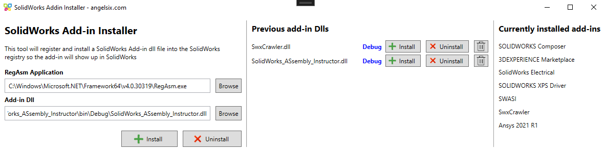

## SolidWorks_ASsembly_Instructor (SWASI)
*English version below*

## 1. Beschreibung
Dieses Add-In für SolidWorks dient dazu, eine Baugruppe mit Informationen wie zum Beispiel Namen, Koordinatensysteme oder Unterbaugruppen in ein JSON-Format zu überführen, um sie später in eine Datenbank einpflegen zu können.

## 2. Voraussetzungen
Um das Tool nutzen zu können, müssen folgende Voraussetzungen gegeben sein:

1. Visual Studio 2022 (neuere Versionen sind wahrscheinlich kompatibel)

2. SolidWorks 2020 (neuere Versionen sind wahrscheinlich kompatibel)

3. GitHub-Konto

4. SolidWorks Add-In Installer ([GitHub](https://github.com/angelsix/solidworks-api/tree/develop/Tools/Addin%20Installer)) ([Alternative EXE in diesem Paket](https://angelsix.com/download/solidworks-files))

## 3. Kompilierung und Installation
### Kompilieren
Nach dem Öffnen des Projekts (SolidWorks_ASsembly_Instructor.sln) in VS22 kann der Build (Strg + B) ausgeführt werden. Das Ausführen über die "Start"-Schaltfläche wird nicht funktionieren, da eine DLL erstellt wird. Nach dem Buildvorgang befindet sich diese und zusätzliche DLLs im Bin-Ordner des Projekts. Die Kompilierung ist nur erfolgreich, wenn SolidWorks zuvor geschlossen wurde.

### Registrieren
Damit SolidWorks die erstellte DLL findet und das Add-In einbinden kann, muss diese in der Registry registriert werden. Dazu wird das Tool "SolidWorks Add-In Installer" verwendet. Zur ersten Nutzung muss auch hier eine Kompilation durchgeführt werden ([Anleitung](https://github.com/angelsix/solidworks-api/blob/develop/Tools/Addin%20Installer/README.md)).

Auf der linken Seite muss die RegAsm-Anwendung ausgewählt werden. Diese sollte standardmäßig eingetragen sein. Unter "Add-in Dll" muss der Pfad zur eigenen DLL (SolidWorks_ASsembly_Instructor.dll) ausgewählt werden. Durch einen Druck auf "Install" wird die DLL in SolidWorks registriert. Dieser Vorgang muss **nicht** ständig nach der Kompilierung wiederholt werden. Über "Previous add-in Dlls" können die eigenen DLLs beliebig deregistriert und neu registriert werden. Auf der rechten Seite befindet sich ein Überblick über alle gerade installierten Add-ins in SolidWorks.

### Verwenden
SolidWorks sollte die registrierte DLL nun in der "Taskpane" auf der rechten Seite am unteren Rand anzeigen. Sollte dies nicht der Fall sein, muss das Add-In zunächst aktiviert werden. Dazu klicke auf den Pfeil neben dem Zahnrad im Menüband, um das Menü für Zusatzanwendungen aufzurufen. Mit der Checkbox auf der linken Seite kann die Anwendung aktiviert werden. Die Checkbox auf der rechten Seite aktiviert das Laden beim Programmstart.

Zunächst muss unter "Save location" ein Speicherort für die JSON-Dateien ausgewählt werden. Nach der Betätigung des "Export as JSON"-Buttons werden mehrere JSON-Dateien an dem angegebenen Speicherort abgelegt. "Refresh part list" löscht die Ausgabe im Log-Fenster.

## 4. Debugging
Um die DLL zu debuggen, muss in Visual Studio unter "Debuggen" -> "An den Prozess anhängen" (Strg + Alt + P) an den Prozess "SLDWORKS.exe" angefügt werden. Nach dem Einstellen kann das erneute Anhängen mittels "Debuggen" -> "Erneut an Prozess anfügen" (Shift + Alt + P) erleichtert werden.

## 5. Struktur
| Ordner oder Datei | Beschreibung |
| ----------- | ----------- |
| TaskpaneHostUI.cs | Enthält sowohl die grafische Oberfläche als auch die Hauptfunktionalität (Wechseln mit (Shift) + F7) |
| TaskpaneIntegration.cs | Ermöglicht die Kommunikation mit SolidWorks (adaptiert von [hier](https://www.youtube.com/watch?v=7DlG6OQeJP0) mit Hilfe von [hier](https://stackoverflow.com/questions/74966397/making-c-sharp-class-library-com-visible-in-visual-studio-2022)) |
| Json/* | Enthält die JSON-Struktur als Klassen |
| AssemblyManager.cs | Haupt-Einstiegspunkt der Anwendung |
| utils/FeatureTypes.cs | Struct zur einfacheren Extraktion von Features |

# English version:

## 1 Description
This add-in for SolidWorks is used to convert an assembly with information such as names, coordinate systems or subassemblies into a JSON format so that it can later be entered into a database.

## 2. Prerequisites
To be able to use the tool, the following requirements must be met:

1. Visual Studio 2022 (newer versions are probably compatible)

2. SolidWorks 2020 (newer versions are probably compatible)

3. GitHub account

4. SolidWorks Add-In Installer ([GitHub](https://github.com/angelsix/solidworks-api/tree/develop/Tools/Addin%20Installer)) ([Alternative EXE in this package](https://angelsix.com/download/solidworks-files))

## 3. Compilation and installation
### Compile
After opening the project (SolidWorks_ASsembly_Instructor.sln) in VS22, the build (Ctrl + B) can be executed. Executing via the "Start" button will not work as a DLL will be created. After the build process, this and additional DLLs can be found in the bin folder of the project. The compilation is only successful if SolidWorks has been closed beforehand.

### Register
In order for SolidWorks to find the created DLL and integrate the add-in, it must be registered in the registry. The "SolidWorks Add-In Installer" tool is used for this purpose. A compilation must also be carried out here for the first use ([Instructions](https://github.com/angelsix/solidworks-api/blob/develop/Tools/Addin%20Installer/README.md)).

The RegAsm application must be selected on the left-hand side. This should be entered by default. Under "Add-in Dll" the path to your own DLL (SolidWorks_ASsembly_Instructor.dll) must be selected. Press "Install" to register the DLL in SolidWorks. This process **does not** have to be repeated constantly after compilation. Via "Previous add-in Dlls" you can deregister and re-register your own DLLs as required. On the right-hand side you will find an overview of all add-ins currently installed in SolidWorks.

### Use
SolidWorks should now display the registered DLL in the "Task Pane" on the right-hand side at the bottom. If this is not the case, the add-in must first be activated. To do this, click on the arrow next to the cogwheel in the ribbon to open the menu for additional applications. The application can be activated using the checkbox on the left-hand side. The checkbox on the right activates loading at program start.

First, a storage location for the JSON files must be selected under "Save location". After clicking the "Export as JSON" button, several JSON files are saved to the specified location. "Refresh part list" deletes the output in the log window.

## 5. Structure
| folder or file | description |
| ----------- | ----------- |
| TaskpaneHostUI.cs | Contains both the graphical user interface and the main functionality (switch with (Shift) + F7) |
| TaskpaneIntegration.cs | Enables communication with SolidWorks (adapted from [here](https://www.youtube.com/watch?v=7DlG6OQeJP0) with the help of [here](https://stackoverflow.com/questions/74966397/making-c-sharp-class-library-com-visible-in-visual-studio-2022)) |
| Json/* | Contains the JSON structure as classes |
| AssemblyManager.cs | Main entry point of the application |
| utils/FeatureTypes.cs | Structure for easier extraction of features |